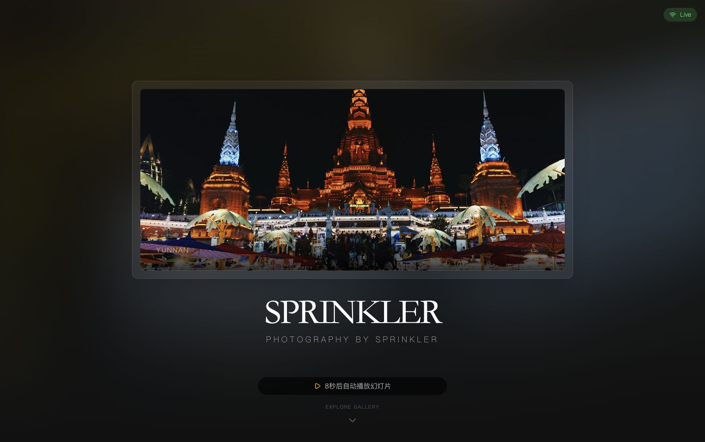
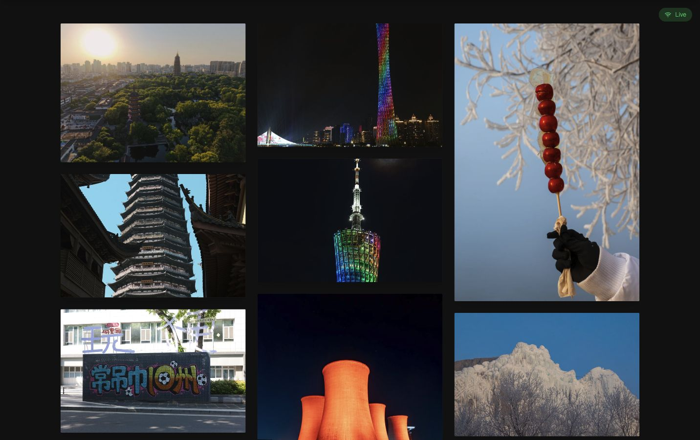
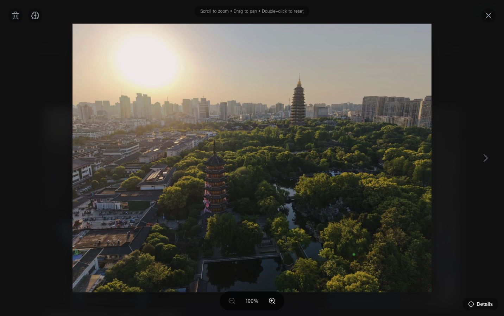
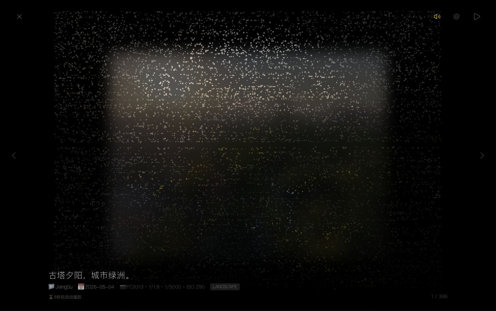
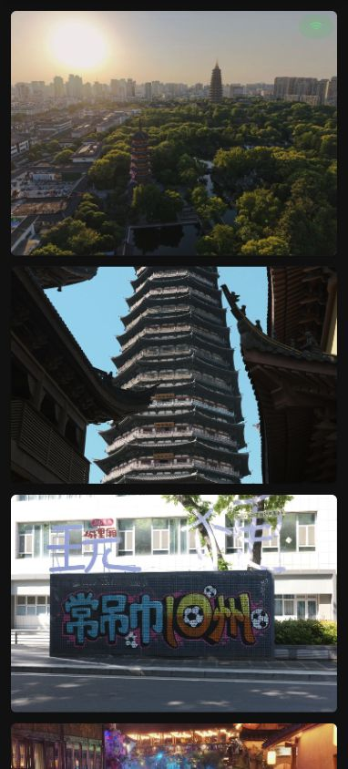

# Smart Gallery

一个本地优先、带 AI 分析能力的个人照片墙。它会扫描本地/NAS/外接硬盘中的照片，自动生成缩略图、提取 EXIF、按文件夹分类，并提供瀑布流、时间线、Lightbox 和沉浸式幻灯片浏览体验。

[](https://react.dev)
[](https://www.typescriptlang.org)
[](https://vite.dev)
[](https://expressjs.com)
[](https://sqlite.org)

## 预览

### 首页


### 照片墙


### 大图预览


### 幻灯片


### 移动端


---

## 功能特性

### 浏览体验
- 瀑布流、网格、时间线三种视图，适合横图、竖图和按时间回看。
- 首页 Hero 自动轮播横图，空闲一段时间后可自动进入幻灯片。
- Lightbox 支持上一张/下一张、滚轮缩放、拖拽、双击重置，移动端支持滑动切换和双指缩放。
- 幻灯片支持淡入淡出、Ken Burns、翻页效果，支持背景音乐、顺序/随机播放、横竖图过滤。
- 针对手机做了小屏导航、分类下拉、触控尺寸、安全区和横向溢出适配。

### 图片与数据
- 多照片源：本地目录、NAS 挂载目录、外接硬盘路径都可以作为来源。
- 文件夹可自动映射为分类。
- Sharp 生成缩略图，缓存可限制大小并自动清理。
- 自动读取 EXIF：相机、镜头、光圈、快门、ISO、拍摄时间等。
- SQLite 保存照片索引和 AI 分析结果，减少重复扫描和重复分析。

### AI 能力
- 多模态模型分析照片内容，生成描述、标签、分类、质量评价。
- 支持模糊搜索和标签/语义搜索。
- AI 分析结果会缓存到 SQLite 和本地缓存目录。
- 可通过管理面板对单张照片或整个图库触发分析。

### 管理与保护
- 本地/内网访问时显示管理入口，支持刷新、重扫、添加/移除照片源、重建缓存。
- 管理员功能使用部署机初始化的密码与 TOTP 动态码认证。
- 禁用图片右键保存、拖拽和常见保存快捷键，降低误下载风险。
- WebSocket 实时同步照片变化。

---

## 快速开始

### 环境要求
- Node.js 18+，推荐 Node.js 22+
- npm
- 可选：`cloudflared`，用于 Cloudflare Tunnel 外网访问

### 安装

```bash
git clone https://github.com/Sprinkler126/smart-gallery.git
cd smart-gallery
npm install
```

### 配置环境变量

复制示例文件：

```bash
cp .env.example .env
```

常用变量：

| 变量 | 说明 |
| --- | --- |
| `AI_API_ENDPOINT` | AI 服务的 OpenAI-compatible 接口地址 |
| `AI_API_KEY` | AI 服务密钥，不要提交到 Git |
| `AI_MODEL` | 使用的模型名称 |
| `AUTH_PASSWORD_HASH` | 部署机初始化生成的管理员密码哈希 |
| `AUTH_TOTP_SECRET` | Google Authenticator 的 TOTP 密钥，仅保存在部署机 |
| `AUTH_SESSION_SECRET` | 服务端会话签名密钥 |
| `PORT` | 可选，后端端口，默认 `3001` |
| `HOST` | 可选，后端监听地址，默认 `0.0.0.0` |

### 配置照片源

编辑 `server/config.json`：

```json
{
  "appName": "SPRINKLER",
  "photographerName": "Sprinkler",
  "imageSources": [
    {
      "id": "photos",
      "name": "My Photos",
      "type": "local",
      "path": "/path/to/photos",
      "enabled": true,
      "defaultCategory": "Gallery",
      "useFolderAsCategory": true,
      "watch": true
    }
  ],
  "enableAutoAnalysis": true
}
```

### 开发模式

```bash
npm run dev
```

默认访问：

- 前端：`http://localhost:3000/photowall/`
- 后端 API：`http://localhost:3001/photowall/api`

如果 `3000` 被占用，Vite 会自动使用下一个可用端口，终端会打印实际地址。

### 生产模式

```bash
npm run build
npm start
```

生产服务由 Express 同时提供 API 和构建后的前端页面，访问：

```text
http://localhost:3001/photowall/
```

---

## 常用命令

| 命令 | 说明 |
| --- | --- |
| `npm run dev` | 同时启动后端和 Vite 前端开发服务 |
| `npm run dev:server` | 只启动 Express API 服务 |
| `npm run dev:client` | 只启动 Vite 前端 |
| `npm run build` | 构建生产前端到 `dist/` |
| `npm start` | 启动生产 Express 服务 |
| `npm run generate` | 根据脚本生成图库数据 |

---

## 快捷键

| 按键 | 功能 |
| --- | --- |
| `Space` | 幻灯片播放/暂停 |
| `← / →` | 上一张/下一张 |
| `T` | 切换幻灯片过渡效果 |
| `R` | 切换随机/顺序播放 |
| `M` | 静音/取消静音 |
| `N` | 下一首背景音乐 |
| `S` | 打开/关闭幻灯片设置 |
| `ESC` | 退出 Lightbox 或幻灯片 |

Lightbox 中还支持：

| 操作 | 功能 |
| --- | --- |
| 鼠标滚轮 | 缩放 |
| 拖拽 | 放大后平移 |
| 双击 | 重置缩放 |
| 移动端左右滑动 | 切换照片 |
| 移动端双指缩放 | 缩放照片 |

---

## 技术架构

### 前端
- React 19 + TypeScript
- Vite 6，部署路径固定为 `/photowall/`
- Tailwind CDN 配置主题色和工具类
- Socket.IO Client 接收图库刷新事件
- 自定义 Lightbox、Slideshow、Timeline、AI Analysis Panel

### 后端
- Node.js + Express
- Socket.IO 实时推送扫描和照片变更
- better-sqlite3 保存照片目录、缓存和 AI 分析结果
- Sharp 生成缩略图和显示图
- Chokidar 监听照片目录变化
- Exifr 读取照片元数据

### AI 与搜索
- OpenAI-compatible 多模态接口用于照片分析
- Universal Sentence Encoder + TensorFlow.js 用于语义向量检索
- 本地分析缓存避免重复调用模型

---

## 项目结构

```text
smart-gallery/
├── App.tsx                       # 主界面、导航、图库视图
├── components/
│   ├── Lightbox.tsx              # 大图预览与缩放
│   ├── Slideshow.tsx             # 幻灯片系统
│   ├── TimelineView.tsx          # 时间线视图
│   ├── AdminPanel.tsx            # 本地管理面板
│   └── AIAnalysisPanel.tsx       # AI 分析与搜索面板
├── hooks/
│   └── useGallery.ts             # 前端图库状态和 API 接入
├── services/                     # 前端 API、Socket、AI 服务封装
├── server/
│   ├── index.js                  # Express 入口
│   ├── routes/api.js             # API 路由
│   ├── services/                 # 图库、数据库、图片处理、AI、向量搜索
│   └── config.json               # 本地图库配置
├── docs/images/                  # README 截图
├── public/photos/                # 可选静态照片目录
└── vite.config.ts                # Vite 配置，base=/photowall/
```

---

## 部署说明

### Cloudflare Tunnel

如果已经配置好 tunnel：

```bash
cloudflared tunnel run photowall
```

项目里的 `start-photowall.sh` 可用于本机常驻启动，并包含 tunnel 进程的简单看护逻辑。

### 注意事项
- `.env` 已被 `.gitignore` 忽略，AI Key、GitHub Token 等敏感信息不要写进 README 或提交记录。
- `server/config.json` 中的本地照片路径需要按部署机器实际路径调整。
- 远程开放管理能力前，请在部署机执行 `npm run auth:init -- --write-env` 并配置 HTTPS。

---

## License

MIT © [Sprinkler126](https://github.com/Sprinkler126)
